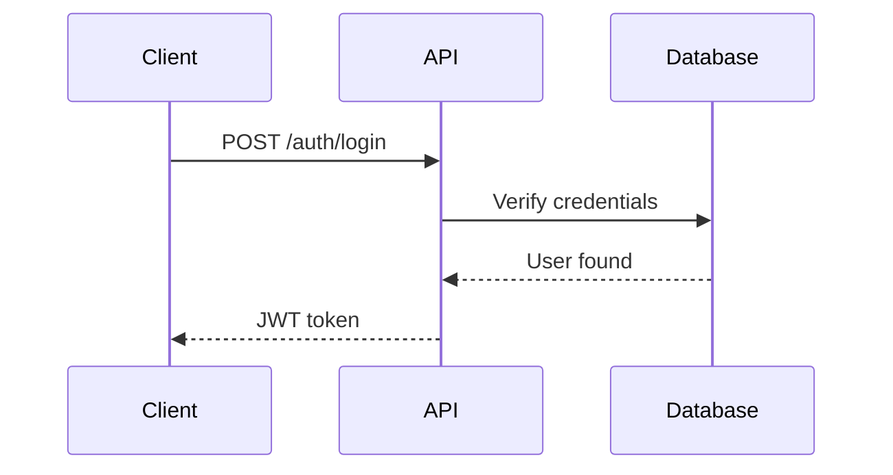

# Doctrack Process Documentation

## Table of Contents

- [Overview](#overview)
- [Operational Modes](#operational-modes)
  - [Single Mode](#single-mode)
  - [Hub Mode](#hub-mode)
- [Session Management](#session-management)
  - [XDG State Directory](#xdg-state-directory)
  - [Session Commands](#session-commands)
- [Core Principles](#core-principles)
- [The 7-Step Process](#the-7-step-process)
  - [Step 0: Initialization](#step-0-initialization)
  - [Step 1: Chunk Repository](#step-1-chunk-repository)
  - [Step 2: Review Chunks](#step-2-review-chunks)
  - [Step 3: Create Tasks](#step-3-create-tasks)
  - [Step 4: Generate Tasks YAML](#step-4-generate-tasks-yaml)
  - [Step 5: Execute Tasks](#step-5-execute-tasks)
  - [Step 6: Human Review](#step-6-human-review)
  - [Step 7: Mark Complete](#step-7-mark-complete)
- [Hub Mode Workflow](#hub-mode-workflow)
  - [Collating Documentation](#collating-documentation)
  - [Building Final Output](#building-final-output)
- [File Locations](#file-locations)
- [State Transitions](#state-transitions)
- [Audience Checklist Usage](#audience-checklist-usage)
- [Standards Application](#standards-application)
- [Workflow Examples](#workflow-examples)

---

## Overview

Doctrack is a systematic approach to creating documentation across multi-repository ecosystems. It provides a structured 7-step process that takes you from source code inventory through task creation, execution, and verification.

**What makes doctrack different:**
- You work repository-by-repository
- Each repository is broken into manageable "chunks"
- Each chunk follows the same 7-step process
- Progress is tracked in `.doctrack/state.yaml`
- Tasks are automation-ready (grind-compatible)

---

## Operational Modes

Doctrack v2 supports two operational modes to accommodate different project structures.

### Single Mode

**Single mode** is designed for working within a single repository or when all repositories are in the same parent directory.

**Characteristics:**
- `.doctrack/` directory is created in the working directory
- Session configuration in `.doctrack/session.yaml`
- State tracked in `.doctrack/state.yaml`
- All repositories referenced with relative or absolute paths
- Ideal for: Single repo projects, monorepos, or co-located multi-repos

**Directory structure:**
```
my-project/
├── .doctrack/
│   ├── session.yaml          # Session configuration
│   ├── state.yaml            # Progress tracking
│   └── {repo}-tasks.yaml     # Generated grind tasks
├── src/                      # Source code
└── docs/
    └── .doctrack/            # Per-repo doctrack files
        └── chunks/
```

### Hub Mode

**Hub mode** is designed for managing documentation across multiple distributed repositories from a central location.

**Characteristics:**
- Central `.doctrack/` hub manages multiple remote repositories
- Each repo maintains its own `docs/.doctrack/` working files
- Use `/dt-collate` to gather completed documentation from repos
- Use `/dt-build` to compile final documentation output
- Ideal for: Multi-repo ecosystems, microservices, distributed teams

**Directory structure:**
```
doctrack-hub/                  # Central hub directory
├── .doctrack/
│   ├── session.yaml          # Hub session configuration
│   ├── state.yaml            # Overall progress tracking
│   ├── collated/             # Gathered documentation
│   └── output/               # Built documentation
│
repos/                         # Distributed repositories
├── repo-a/
│   └── docs/.doctrack/       # Repo-specific doctrack files
├── repo-b/
│   └── docs/.doctrack/
└── repo-c/
    └── docs/.doctrack/
```

---

## Session Management

Doctrack v2 uses a session-based model for tracking work across multiple Claude conversations.

### XDG State Directory

Session state is persisted following XDG Base Directory specification:
- **Location:** `$XDG_STATE_HOME/doctrack/` (defaults to `~/.local/state/doctrack/`)
- **Purpose:** Track active sessions, recent sessions, and session metadata
- **Contents:**
  - `active_session` - Path to current active session
  - `sessions/` - Directory of session metadata

### Session Commands

**`/dt-sessions`** - List and manage documentation sessions

```bash
/dt-sessions
# Lists all known sessions with their status:
# - Session name/path
# - Last accessed date
# - Progress summary (repos complete/total)
# - Active indicator

/dt-sessions --active
# Shows details of the currently active session
```

**`/dt-use {session-path}`** - Switch to a different session

```bash
/dt-use /path/to/project/.doctrack
# Switches active session to the specified path
# Loads session.yaml and state.yaml from that location

/dt-use my-project
# Can use session name if previously registered
```

**Session workflow:**
```bash
# Start a new session
cd /path/to/my-project
/dt-init
# Creates .doctrack/session.yaml and registers session

# Later, in a new Claude conversation
/dt-sessions
# See available sessions

/dt-use /path/to/my-project/.doctrack
# Resume working on that project

/dt-status
# See where you left off
```

---

## Core Principles

### Source Code Is Truth

This is the **fundamental principle** that drives the entire process:

- **We read source code** to understand what exists
- **We identify documentation needs** based on what the code does
- **We do NOT audit** against existing documentation
- **We do NOT compare** to what old docs say
- **We do NOT care** if existing docs are wrong, outdated, or misleading

### This Is NOT an Audit System

Traditional documentation audits compare existing documentation against some standard or against the code. **Doctrack does not do this.**

Instead, doctrack:
1. Reads source code directly
2. Understands what it does
3. Identifies what documentation is NEEDED
4. Creates tasks to write that documentation from scratch

### Why "Review" Not "Audit"

Throughout doctrack, we use the term **"review"** to mean:
- Reading and understanding source code
- Identifying what needs documentation
- Planning what to write

We **never** use "audit" because it implies comparison against existing documentation, which we explicitly do not do.

### Existing Documentation May Be Wrong

Assume nothing about existing documentation:
- It may be completely wrong
- It may be outdated
- It may describe features that no longer exist
- It may miss critical functionality

**Therefore, we ignore it.** We write documentation based solely on reading and understanding the source code.

---

## The 7-Step Process

For each repository in your session.yaml, you will follow these seven steps. The process is repeated for each repository until all are complete.

---

### Step 0: Initialization

**Command:** `/dt-init`

**Purpose:** Set up the doctrack system by reading configuration and creating initial state.

#### Prerequisites

1. Run `/dt-init` to interactively create `session.yaml` in your `.doctrack/` directory
2. Define:
   - Repositories to track (name, path, content type, priority)
   - Audiences (admin, developer, end-user, etc.)
   - Documentation standards (docstring style, diagram format)

#### What This Step Does

1. Reads `.doctrack/session.yaml` configuration
2. Validates all repository paths exist
3. Creates `.doctrack/state.yaml` with all repositories in "pending" status
4. Reports readiness

#### Input

- `.doctrack/session.yaml` (configuration file)

#### Output

- `.doctrack/state.yaml` (state tracking file)
- Terminal report showing all repositories and their status

#### State Transitions

```
No state → All repos: "pending" (step 0)
```

#### Success Criteria

- All repository paths validated
- `.doctrack/state.yaml` created with correct structure
- All repositories marked as "pending"

#### Files Created

```
.doctrack/state.yaml
```

#### Example Output

```
DOCTRACK INITIALIZED
====================

Project: My Project
Repositories: 3

REPO                PATH                          STATUS
----                ----                          ------
core-api            /path/to/core-api             OK
automation          /path/to/automation           OK
config-schemas      /path/to/schemas              OK

State file: .doctrack/state.yaml

Next: /dt-status or /dt-chunk {repo-name}
```

---

### Step 1: Chunk Repository

**Command:** `/dt-chunk {repo-name}`

**Purpose:** Inventory all source files and create a logical chunk list for systematic review.

#### What This Step Does

1. Reads `.doctrack/state.yaml` to verify repository hasn't been chunked
2. Reads `.doctrack/session.yaml` to get repository configuration
3. Scans all source files in configured directories
4. Groups files into logical chunks (max ~10 files per chunk)
5. Creates CHUNK_TRACKING.md in the repository
6. Updates `.doctrack/state.yaml`

#### Input

- `.doctrack/session.yaml` (repository configuration)
- `.doctrack/state.yaml` (current state)
- Source files in repository

#### Output

- `{repo}/docs/.doctrack/CHUNK_TRACKING.md` (chunk inventory)
- Updated `.doctrack/state.yaml`

#### File Scanning Strategy

Based on `content_type` in session.yaml:

| Content Type | Files Scanned | Pattern |
|-------------|---------------|---------|
| python | Python source | `find src/ -name "*.py"` |
| ansible | Ansible playbooks/roles | `find roles/ playbooks/ -name "*.yml"` |
| json-schema | JSON schemas | `find . -name "*.json"` |
| yaml-config | YAML configs | `find . -name "*.yaml" -o -name "*.yml"` |
| mixed | Multiple patterns | Combine relevant patterns |

#### Chunking Strategy

Files are grouped by:
1. **Functional area** (auth, database, API, config, etc.)
2. **Module boundaries** (related files stay together)
3. **Size constraints** (max ~10 files per chunk)

#### Chunk ID Format

```
{PREFIX}-{AREA}-{NNN}
```

Examples:
- `API-AUTH-001` (core-api repo, authentication area, chunk 1)
- `AUTO-DEPLOY-002` (automation repo, deployment area, chunk 2)
- `SCHEMA-CONFIG-001` (config-schemas repo, config area, chunk 1)

#### CHUNK_TRACKING.md Structure

```markdown
# Documentation Tracking: {repo-name}

## Summary

| Priority | Chunks | Files |
|----------|--------|-------|
| High     | N      | N     |
| Medium   | N      | N     |
| Low      | N      | N     |
| **Total**| **N**  | **N** |

## Chunk List

| Chunk ID | Description | Priority | Files | Status |
|----------|-------------|----------|-------|--------|
| API-AUTH-001 | Authentication | High | 8 | Pending |
| API-USERS-002 | User management | High | 6 | Pending |

## Recommended Review Order

1. API-AUTH-001 (High priority, core functionality)
2. API-USERS-002 (High priority, depends on auth)
...

## Chunk Details

### API-AUTH-001: Authentication

**Priority:** High
**Status:** Pending

**Files:**
- src/auth/login.py
- src/auth/logout.py
- src/auth/token.py
...

**Audience Checklist:**

Admin:
- [ ] Operational procedures documented
- [ ] CLI/TUI usage clear
- [ ] Configuration options explained

Developer:
- [ ] API reference complete
- [ ] Examples provided
- [ ] Error handling documented
```

#### State Transitions

```
.doctrack/state.yaml updates:
  repositories.{repo-name}.status: "pending" → "in_progress"
  repositories.{repo-name}.current_step: 0 → 1
  repositories.{repo-name}.step_name: null → "Chunk Repository"
  repositories.{repo-name}.chunks_total: null → N
  repositories.{repo-name}.tracking_file: null → "{path}/docs/.doctrack/CHUNK_TRACKING.md"
  repositories.{repo-name}.started: null → {timestamp}
```

#### Success Criteria

- All source directories scanned
- Files grouped into logical chunks
- CHUNK_TRACKING.md created with all required sections
- `.doctrack/state.yaml` updated with chunk count
- Chunk IDs follow naming convention

#### What NOT to Do

- ❌ Don't skip any source directories
- ❌ Don't create chunks larger than ~10 files
- ❌ Don't read or consider existing documentation quality
- ❌ Don't forget to update `.doctrack/state.yaml`

#### Next Step

After chunking, you have two options:
1. Run `/dt-review {chunk-id}` to start reviewing the first chunk
2. Run `/dt-status` to see the full repository status

---

### Step 2: Review Chunks

**Command:** `/dt-review {chunk-id}`

**Purpose:** Read source code for a chunk and identify documentation needs.

**CRITICAL:** This is NOT an audit. You are reading source code to understand what it does and identifying what documentation needs to be written.

#### What This Step Does

1. Reads CHUNK_TRACKING.md to get chunk details
2. Reads ALL source files for this chunk completely
3. Understands what the code does
4. Identifies what documentation is needed (docstrings, guides, examples)
5. Applies audience checklist requirements
6. Displays review results (does not save yet)

#### Input

- `{repo}/docs/.doctrack/CHUNK_TRACKING.md` (chunk metadata)
- Source files listed in the chunk
- `.doctrack/session.yaml` (audience checklists, standards)
- `.doctrack/state.yaml` (current state)

#### Output

- Review results displayed in terminal (NOT saved to file yet)
- Updated `.doctrack/state.yaml`

#### Source Code Analysis

For each file in the chunk, identify:

**Code Elements:**
- Public functions, classes, methods
- Parameters and return types
- Exceptions raised
- Side effects (file I/O, network, state changes)
- Configuration options read
- Entry points / CLI commands

**Documentation Needs:**
- Missing docstrings
- Missing parameter descriptions
- Missing return value descriptions
- Missing exception documentation
- Missing usage examples
- Missing integration examples
- Missing architecture diagrams
- Missing configuration guides

#### Audience Checklist Application

Apply the checklist from session.yaml for each audience:

**Example for Admin audience:**
- [ ] Operational procedures documented
- [ ] CLI/TUI usage clear
- [ ] Configuration options explained
- [ ] Troubleshooting guide included

**Example for Developer audience:**
- [ ] API reference complete
- [ ] Examples provided
- [ ] Error handling documented
- [ ] Architecture diagrams included

#### Output Format

```markdown
## Review Results: {chunk-id}

**Source:** {file paths}
**Review Date:** {date}

### What This Code Does

{Brief description based on reading the source code}

Example:
"This chunk implements user authentication, including login, logout,
token generation, and token validation. It integrates with the database
layer to verify credentials and uses JWT for session management."

### Documentation Needed

#### Docstrings

- [ ] `authenticate_user()` - needs docstring with parameters, returns, exceptions
- [ ] `TokenManager` class - needs class docstring
- [ ] `TokenManager.generate()` - needs method docstring
- [ ] `validate_token()` - needs docstring

#### Narrative Documentation

- [ ] Overview of authentication flow (admin, developer)
- [ ] How-to guide for implementing auth in new endpoints (developer)
- [ ] Configuration guide for auth settings (admin)
- [ ] Troubleshooting guide for auth failures (admin)

#### Examples

- [ ] Basic usage example for authenticate_user()
- [ ] Integration example showing full auth workflow
- [ ] Example token validation in API endpoint
- [ ] Example configuration for different auth modes

#### Diagrams

- [ ] Authentication flow diagram (Mermaid sequence diagram)
- [ ] Token lifecycle diagram

### Audience Coverage

**Admin:**
- Configuration guide needed (auth settings, token expiry, etc.)
- Troubleshooting guide needed (common auth errors)
- Operational procedures needed (key rotation, etc.)

**Developer:**
- API reference needed (all public functions)
- Integration examples needed (how to use auth in endpoints)
- Error handling guide needed (what exceptions to catch)

### Next Steps

Use `/dt-task {chunk-id}` to create documentation tasks.
```

#### State Transitions

```
.doctrack/state.yaml updates:
  repositories.{repo-name}.chunks_reviewed: N → N+1
  repositories.{repo-name}.current_chunk: null → {chunk-id}
  repositories.{repo-name}.current_step: 1 → 2
  repositories.{repo-name}.step_name: "Chunk Repository" → "Review Chunks"
```

#### What NOT to Do

- ❌ **DO NOT** read existing documentation
- ❌ **DO NOT** compare against what docs currently say
- ❌ **DO NOT** assume existing docs are correct
- ❌ **DO NOT** skip any public APIs or functions
- ❌ **DO NOT** save review results to file (that's step 3)

#### Success Criteria

- All source files read completely
- Code functionality understood
- Documentation needs identified for all public APIs
- Audience checklist applied
- Review results displayed clearly

#### Next Step

After reviewing, run `/dt-task {chunk-id}` to create actionable documentation tasks.

---

### Step 3: Create Tasks

**Command:** `/dt-task {chunk-id}`

**Purpose:** Transform review findings into detailed, actionable documentation tasks.

#### What This Step Does

1. Reviews the findings from `/dt-review` (in conversation context)
2. Creates specific, actionable tasks for each documentation need
3. Includes verification steps for each task
4. Generates grind-compatible YAML
5. Saves task file to repository
6. Updates `.doctrack/state.yaml`

#### Input

- Review results from Step 2 (in conversation context or re-run `/dt-review`)
- `.doctrack/session.yaml` (standards configuration)
- `.doctrack/state.yaml` (current state)

#### Output

- `{repo}/docs/.doctrack/chunks/{chunk-id}-task.md` (task file)
- Updated `.doctrack/state.yaml`

#### Task Creation Strategy

For each documentation need identified in review:

**Specify:**
- **What** to document (specific function, guide, example)
- **Where** to put it (file path, section)
- **What format** (docstring, markdown, code example)
- **How to verify** (what to check to ensure it's correct)
- **Which audience** it serves
- **Which standards** to apply

#### Task File Structure

```markdown
# Documentation Task: {chunk-id}

Generated: {date}
From review: {date}

## Source Files

- src/auth/login.py
- src/auth/logout.py
- src/auth/token.py
...

## Documentation to Create

### Task 1: Document authenticate_user function

- **What:** Add comprehensive docstring to authenticate_user() function
- **Where:** src/auth/login.py, line 45
- **Format:** Docstring (NumPy style)
- **Standards:** NumPy docstring format, include Parameters, Returns, Raises
- **Audience:** Developer
- **Verify:**
  - Docstring follows NumPy format
  - All parameters documented with types
  - Return value documented
  - All exceptions listed
  - Example included

### Task 2: Create authentication flow guide

- **What:** Write narrative documentation explaining authentication flow
- **Where:** docs/guides/authentication.md
- **Format:** Markdown with Mermaid diagram
- **Standards:** Include sequence diagram, code examples
- **Audience:** Admin, Developer
- **Verify:**
  - Mermaid sequence diagram showing full flow
  - Step-by-step explanation
  - Code examples for login, logout, token validation
  - Configuration options documented

### Task 3: Add authentication examples

- **What:** Create working code examples for auth integration
- **Where:** docs/examples/authentication.md
- **Format:** Markdown with code blocks
- **Standards:** Examples must be runnable
- **Audience:** Developer
- **Verify:**
  - Basic login example runs
  - Token validation example runs
  - Error handling example included
  - Integration example shows full workflow

## Audience Coverage

- [x] Admin: Configuration guide, troubleshooting
- [x] Developer: API reference, examples, integration guide
- [ ] End-user: N/A for this chunk

## Grind Task YAML

```yaml
- id: "doc-API-AUTH-001"
  task: |
    Create documentation for API-AUTH-001 (Authentication).

    ## Source Files
    - src/auth/login.py
    - src/auth/logout.py
    - src/auth/token.py

    ## Documentation to Create

    ### 1. Docstrings (NumPy style)

    Add comprehensive docstrings to:
    - authenticate_user() - src/auth/login.py:45
    - logout_user() - src/auth/logout.py:23
    - TokenManager class - src/auth/token.py:10
    - TokenManager.generate() - src/auth/token.py:34
    - validate_token() - src/auth/token.py:67

    Each docstring must include:
    - Brief description
    - Parameters (with types)
    - Returns (with type)
    - Raises (all exceptions)
    - Examples (runnable code)

    ### 2. Narrative Documentation

    Create docs/guides/authentication.md with:
    - Overview of authentication system
    - Mermaid sequence diagram of auth flow
    - Configuration options explained
    - Troubleshooting common issues

    ### 3. Code Examples

    Create docs/examples/authentication.md with:
    - Basic login/logout example
    - Token generation and validation
    - Error handling patterns
    - Full integration example

    ## Standards

    - Docstrings: NumPy style
    - Diagrams: Mermaid format
    - Examples: Must be runnable and tested
    - DO NOT reference existing docs
    - Write from source code only

    ## Audience Requirements

    Admin:
    - Configuration options clear
    - Troubleshooting guide included

    Developer:
    - API reference complete
    - Examples working
    - Error handling documented

  verify: |
    # Check docstrings exist
    grep -q "Parameters" src/auth/login.py && \
    grep -q "Returns" src/auth/login.py && \
    # Check docs exist
    test -f docs/guides/authentication.md && \
    test -f docs/examples/authentication.md && \
    # Check diagrams present
    grep -q "mermaid" docs/guides/authentication.md

  model: sonnet
  max_iterations: 3
```
```

## Critical Instructions for Tasks

Each task MUST include:

```
DO NOT reference existing docs. Write from source code.
```

This ensures the agent writing documentation:
1. Reads source code directly
2. Understands what it does
3. Writes documentation from that understanding
4. Does NOT copy or validate against old docs

#### State Transitions

```
.doctrack/state.yaml updates:
  repositories.{repo-name}.chunks_tasked: N → N+1
  repositories.{repo-name}.current_step: 2 → 3
  repositories.{repo-name}.step_name: "Review Chunks" → "Create Tasks"
```

#### Success Criteria

- Task file created with all sections
- Each task has clear what/where/format/verify
- Grind YAML is valid and complete
- Standards from session.yaml applied
- Audience requirements covered
- `.doctrack/state.yaml` updated

#### What NOT to Do

- ❌ Don't be vague about what to write ("improve docs")
- ❌ Don't skip verification steps
- ❌ Don't reference existing docs as baseline
- ❌ Don't create tasks without clear success criteria

#### Next Step

After creating tasks for all chunks, run `/dt-generate {repo-name}` to compile into a single tasks.yaml file.

---

### Step 4: Generate Tasks YAML

**Command:** `/dt-generate {repo-name}`

**Purpose:** Compile all chunk task files into a single grind-ready YAML file.

#### What This Step Does

1. Reads `.doctrack/session.yaml` for repository path
2. Finds all `*-task.md` files in `{repo}/docs/.doctrack/chunks/`
3. Extracts grind YAML blocks from each task file
4. Combines into single tasks.yaml file
5. Orders by dependencies (if specified)
6. Saves to `.doctrack/{repo-name}-tasks.yaml`
7. Updates `.doctrack/state.yaml`

#### Input

- `.doctrack/session.yaml` (repository configuration)
- `{repo}/docs/.doctrack/chunks/*-task.md` (all task files)
- `.doctrack/state.yaml` (current state)

#### Output

- `.doctrack/{repo-name}-tasks.yaml` (compiled tasks file)
- Updated `.doctrack/state.yaml`

#### Generated File Structure

```yaml
# Generated by doctrack /generate
# Repository: core-api
# Generated: 2025-12-06 17:30:00

tasks:
  - id: "doc-API-AUTH-001"
    task: |
      Create documentation for API-AUTH-001 (Authentication).

      Source files:
      - src/auth/login.py
      - src/auth/logout.py

      Documentation needed:
      1. Docstrings for all public functions
      2. Authentication flow guide
      3. Usage examples

      Standards:
      - Docstrings: NumPy style
      - Diagrams: Mermaid
      - Examples: Required and tested

      DO NOT reference existing docs. Write from source code.
    verify: |
      test -f docs/guides/authentication.md && \
      grep -q "Parameters" src/auth/login.py
    model: sonnet
    max_iterations: 3

  - id: "doc-API-USERS-002"
    task: |
      Create documentation for API-USERS-002 (User Management).
      ...
    model: sonnet
    max_iterations: 3
```

#### State Transitions

```
.doctrack/state.yaml updates:
  repositories.{repo-name}.current_step: 3 → 4
  repositories.{repo-name}.step_name: "Create Tasks" → "Generate Tasks YAML"
  repositories.{repo-name}.status: "in_progress" → "ready"
```

#### Success Criteria

- All task files found and processed
- YAML is valid and grind-compatible
- All tasks included with correct IDs
- Output file created in `.doctrack/` directory
- `.doctrack/state.yaml` updated

#### Output Message

```
TASKS COMPILED
==============

Repository: core-api
Task files found: 12
Output: .doctrack/core-api-tasks.yaml

Next: grind batch .doctrack/core-api-tasks.yaml
```

#### Next Step

Execute the tasks using grind: `grind batch .doctrack/{repo-name}-tasks.yaml`

---

### Step 5: Execute Tasks

**Command:** `grind batch .doctrack/{repo-name}-tasks.yaml`

**Purpose:** Execute documentation tasks using automation (grind).

**Note:** This step uses grind, not a doctrack slash command.

#### What This Step Does

1. Grind reads the tasks.yaml file
2. For each task:
   - Reads source files
   - Understands code functionality
   - Writes documentation per specifications
   - Runs verification commands
3. Iterates until verification passes or max_iterations reached
4. Reports success/failure for each task

#### Input

- `.doctrack/{repo-name}-tasks.yaml` (compiled tasks)
- Source code files
- `.doctrack/session.yaml` (for standards reference)

#### Output

- Docstrings added to source files
- Markdown documentation files created
- Example files created
- Verification results

#### Execution Options

**Sequential execution:**
```bash
grind batch .doctrack/core-api-tasks.yaml
```

**Parallel execution:**
```bash
grind dag .doctrack/core-api-tasks.yaml --parallel 2
```

#### What Grind Does Per Task

1. **Reads the task specification**
   - Understands what documentation to create
   - Notes file locations
   - Checks format requirements
   - Reviews standards to apply

2. **Reads source code**
   - Opens all source files listed
   - Analyzes functions, classes, methods
   - Understands parameters, returns, exceptions
   - Identifies side effects and configuration

3. **Writes documentation**
   - Adds docstrings in specified format
   - Creates markdown files
   - Writes working code examples
   - Generates diagrams if needed

4. **Verifies**
   - Runs verification command
   - Checks files exist
   - Validates format
   - Re-iterates if verification fails

#### Grind Respects the Core Principle

Each task includes:
```
DO NOT reference existing docs. Write from source code.
```

This ensures grind:
- Reads source code directly
- Documents what the code DOES
- Does NOT compare to old documentation
- Does NOT copy from existing docs

#### State Transitions

```
.doctrack/state.yaml updates:
  repositories.{repo-name}.current_step: 4 → 5
  repositories.{repo-name}.step_name: "Generate Tasks YAML" → "Execute Tasks"
```

**Note:** This state transition should be done manually or by running `/dt-status` after grind completes.

#### Success Criteria

- All tasks executed
- Verification commands pass
- Documentation created in correct locations
- No errors in grind output

#### Common Issues

**Issue:** Verification fails repeatedly
- Check verification command is correct
- Ensure file paths match specifications
- Review grind output for specific errors

**Issue:** Documentation quality is poor
- Review task specifications for clarity
- Check standards are properly specified
- Consider increasing max_iterations

**Issue:** Examples don't run
- Ensure source code is actually runnable
- Check imports and dependencies
- Verify examples use correct API

#### Next Step

After grind completes, proceed to Step 6: Human Review

---

### Step 6: Human Review

**Purpose:** Manually review generated documentation for quality, accuracy, and completeness.

**Note:** This is a manual step, no command.

#### What This Step Does

A human reviewer:
1. Reads generated documentation
2. Verifies accuracy against source code
3. Checks for completeness
4. Evaluates quality and clarity
5. Tests code examples
6. Identifies issues or gaps

#### What to Review

**Docstrings:**
- [ ] All public APIs documented
- [ ] Parameters described with correct types
- [ ] Return values documented
- [ ] Exceptions listed
- [ ] Examples are accurate and runnable
- [ ] Format matches standards (NumPy/Google/Sphinx)

**Narrative Documentation:**
- [ ] Overview is clear and accurate
- [ ] Explanations match what code does
- [ ] Diagrams are correct
- [ ] Configuration options explained properly
- [ ] Troubleshooting steps are helpful

**Code Examples:**
- [ ] Examples run without errors
- [ ] Examples demonstrate key functionality
- [ ] Error handling shown
- [ ] Integration patterns clear
- [ ] Code follows best practices

**Audience Coverage:**
- [ ] Admin requirements met (config, operations, troubleshooting)
- [ ] Developer requirements met (API, examples, integration)
- [ ] End-user requirements met (guides, workflows)

#### Review Checklist

```markdown
## Documentation Review: {chunk-id}

**Reviewer:** {name}
**Review Date:** {date}

### Completeness
- [ ] All tasks from task file completed
- [ ] No missing docstrings
- [ ] All guides created
- [ ] All examples present

### Accuracy
- [ ] Docstrings match actual code behavior
- [ ] Guides accurately describe functionality
- [ ] Examples produce expected results
- [ ] Diagrams reflect actual flow

### Quality
- [ ] Clear and concise writing
- [ ] Proper grammar and formatting
- [ ] Consistent terminology
- [ ] Appropriate level of detail

### Standards Compliance
- [ ] Docstrings follow {style}
- [ ] Diagrams use Mermaid
- [ ] Examples are tested
- [ ] No references to old docs

### Issues Found
1. {issue description}
2. {issue description}

### Action Items
1. {fix needed}
2. {fix needed}

### Status
- [ ] APPROVED - Ready to mark complete
- [ ] NEEDS WORK - Issues must be fixed
- [ ] BLOCKED - Cannot proceed
```

#### Common Review Findings

**Good signs:**
- ✅ Documentation describes what code actually does
- ✅ Examples run and produce correct output
- ✅ Clear, concise explanations
- ✅ No references to outdated information

**Red flags:**
- ❌ Docstrings don't match actual parameters
- ❌ Examples fail or produce errors
- ❌ Guides describe features that don't exist
- ❌ References to old documentation

#### Fixing Issues

If issues are found:

**Option 1: Manual fixes** (for small issues)
- Edit files directly
- Fix typos, improve clarity
- Adjust examples

**Option 2: Re-run grind** (for larger issues)
- Update task specifications
- Re-run specific tasks
- Verify fixes

**Option 3: Create follow-up tasks**
- Document what's missing
- Add to backlog
- Address in next iteration

#### State Transitions

No automatic state transitions. Human reviewer decides when to proceed to Step 7.

#### Next Step

When review is complete and approved, run `/dt-complete {chunk-id}` to mark chunk as complete.

---

### Step 7: Mark Complete

**Command:** `/dt-complete {chunk-id}`

**Purpose:** Verify documentation was created correctly and mark chunk complete.

#### What This Step Does

1. Reads the original task file
2. Verifies each task was completed
3. Runs quality checks
4. Marks status as COMPLETE, PARTIAL, or BLOCKED
5. Updates CHUNK_TRACKING.md with results
6. Updates `.doctrack/state.yaml`

#### Input

- `{repo}/docs/.doctrack/chunks/{chunk-id}-task.md` (original task file)
- Generated documentation files
- Source files with docstrings
- `.doctrack/state.yaml` (current state)

#### Output

- Completion report (displayed)
- Updated `CHUNK_TRACKING.md`
- Updated `.doctrack/state.yaml`

#### Verification Process

For each task in the task file:

1. **Check file exists**
   - Verify file at specified path exists
   - Check it's not empty

2. **Verify content matches requirements**
   - Docstrings follow specified format
   - Markdown files have required sections
   - Examples include necessary code

3. **Validate format**
   - Docstrings use correct style (NumPy/Google/Sphinx)
   - Markdown is properly formatted
   - Code blocks have language tags

4. **Test examples**
   - Code examples run without errors
   - Examples produce expected output
   - Imports and dependencies work

5. **Check audience requirements**
   - Admin checklist items covered
   - Developer checklist items covered
   - End-user checklist items covered

#### Completion Statuses

**COMPLETE:**
- All tasks finished
- All verification checks pass
- Audience requirements met
- Quality standards met

**PARTIAL:**
- Some tasks finished
- Some verification checks fail
- Some audience requirements not met
- Follow-up work needed

**BLOCKED:**
- Cannot complete tasks
- Blockers identified (missing source, dependencies, etc.)
- Requires external action

#### Output Format

```markdown
## Completion Report: API-AUTH-001

**Verification Date:** 2025-12-06
**Status:** COMPLETE

### Tasks Verified

#### Task 1: Document authenticate_user function
- **Status:** ✓ Complete
- **Location:** src/auth/login.py:45
- **Notes:** Docstring follows NumPy format, all parameters documented

#### Task 2: Create authentication flow guide
- **Status:** ✓ Complete
- **Location:** docs/guides/authentication.md
- **Notes:** Mermaid diagram present, examples working

#### Task 3: Add authentication examples
- **Status:** ✓ Complete
- **Location:** docs/examples/authentication.md
- **Notes:** All examples tested and run successfully

### Quality Checks

- [x] All required files created
- [x] Docstrings follow NumPy style
- [x] Examples tested and working
- [x] Audience coverage complete
- [x] No references to old docs

### Summary

All documentation tasks for API-AUTH-001 completed successfully.
Docstrings added to all public functions, guides created with working
examples, and audience requirements met.

### Next Steps

Chunk is ready to close. Proceed to next chunk: API-USERS-002
```

#### State Transitions

```
.doctrack/state.yaml updates:
  repositories.{repo-name}.chunks_complete: N → N+1
  repositories.{repo-name}.current_step: 6 → 7
  repositories.{repo-name}.step_name: "Human Review" → "Mark Complete"

CHUNK_TRACKING.md updates:
  chunks.{chunk-id}.status: "Pending" → "Complete"
  chunks.{chunk-id}.completed_date: {timestamp}
```

**If all chunks complete:**
```
.doctrack/state.yaml updates:
  repositories.{repo-name}.status: "in_progress" → "complete"
  repositories.{repo-name}.completed: {timestamp}
  summary.complete: N → N+1
  summary.in_progress: N → N-1
```

#### Success Criteria

- All tasks verified
- Quality checks pass
- Chunk status updated
- `.doctrack/state.yaml` reflects progress

#### What NOT to Do

- ❌ Don't mark COMPLETE if tasks remain unfinished
- ❌ Don't skip verification steps
- ❌ Don't approve without checking examples run

#### Next Steps

**If more chunks remain:**
- Run `/dt-review {next-chunk-id}` to continue

**If all chunks complete:**
- Run `/dt-status` to see overall progress
- Move to next repository: `/dt-chunk {next-repo-name}`

**If all repositories complete:**
- Documentation work finished!
- Review `.doctrack/state.yaml` for final summary

---

## Hub Mode Workflow

Hub mode provides additional commands for managing documentation across distributed repositories.

### Collating Documentation

**Command:** `/dt-collate`

**Purpose:** Gather completed documentation from all repositories into the central hub.

#### What This Step Does

1. Reads `.doctrack/session.yaml` to get repository list
2. For each repository with completed chunks:
   - Copies generated guides from `{repo}/docs/guides/`
   - Copies generated examples from `{repo}/docs/examples/`
   - Copies diagrams from `{repo}/docs/diagrams/`
3. Organizes files in `.doctrack/collated/` by repository
4. Updates manifest with collation metadata
5. Reports collation summary

#### Input

- `.doctrack/session.yaml` (repository list)
- `.doctrack/state.yaml` (completion status)
- Generated documentation in each repository

#### Output

- `.doctrack/collated/{repo}/` directories with gathered docs
- `.doctrack/collated/manifest.yaml` with metadata

#### Example Usage

```bash
# After completing documentation for multiple repos
/dt-collate
# → Gathers docs from: core-api, automation, config-schemas
# → Creates .doctrack/collated/ structure
# → Reports: 45 guides, 32 examples, 12 diagrams collected
```

#### Collated Structure

```
.doctrack/collated/
├── manifest.yaml              # Collation metadata
├── core-api/
│   ├── guides/
│   │   ├── authentication.md
│   │   └── user-management.md
│   └── examples/
│       └── authentication.md
├── automation/
│   └── guides/
│       └── deployment.md
└── config-schemas/
    └── guides/
        └── schema-reference.md
```

### Building Final Output

**Command:** `/dt-build`

**Purpose:** Compile collated documentation into final output format.

#### What This Step Does

1. Reads `.doctrack/collated/manifest.yaml`
2. Applies output configuration from session.yaml
3. Generates:
   - Combined table of contents
   - Cross-repository index
   - Unified navigation structure
4. Outputs to `.doctrack/output/`
5. Optionally generates static site (if configured)

#### Input

- `.doctrack/collated/` (gathered documentation)
- `.doctrack/session.yaml` (output configuration)

#### Output

- `.doctrack/output/` (final documentation)
- Index files and navigation

#### Build Configuration

In `.doctrack/session.yaml`:

```yaml
build:
  output_format: mkdocs    # mkdocs | sphinx | hugo | plain
  output_dir: .doctrack/output
  title: "My Project Documentation"
  nav_structure: auto      # auto | manual
  cross_references: true   # Enable cross-repo links
```

#### Example Usage

```bash
# After collating documentation
/dt-build
# → Reads collated documentation
# → Generates unified structure
# → Creates .doctrack/output/ with final docs
# → Reports: Documentation built successfully

# Preview the result (if mkdocs)
cd .doctrack/output && mkdocs serve
```

#### Hub Mode Complete Workflow

```bash
# 1. Initialize hub session
/dt-init --hub
# → Creates hub session with multi-repo configuration

# 2. Work through each repository
/dt-chunk core-api
/dt-review API-AUTH-001
/dt-task API-AUTH-001
# ... complete all chunks for all repos

# 3. Collate completed documentation
/dt-collate
# → Gathers docs from all completed repos

# 4. Build final output
/dt-build
# → Creates unified documentation site

# 5. Verify and publish
/dt-status
# → Shows hub completion status
```

---

## File Locations

### Configuration Files

| File | Location | Purpose |
|------|----------|---------|
| session.yaml | .doctrack/ | Project/session configuration |
| state.yaml | .doctrack/ | Progress tracking |
| config.schema.json | doctrack/ | Config validation schema |

### Repository Files

| File | Location | Purpose |
|------|----------|---------|
| CHUNK_TRACKING.md | {repo}/docs/.doctrack/ | Chunk inventory |
| {chunk-id}-task.md | {repo}/docs/.doctrack/chunks/ | Task specifications |

### Generated Files

| File | Location | Purpose |
|------|----------|---------|
| {repo}-tasks.yaml | .doctrack/ | Grind task file |

### Documentation Output

| File | Location | Purpose |
|------|----------|---------|
| Docstrings | {repo}/src/ | Inline documentation |
| Guides | {repo}/docs/guides/ | Narrative documentation |
| Examples | {repo}/docs/examples/ | Code examples |
| Diagrams | {repo}/docs/diagrams/ | Visual documentation |

### Directory Structure Example

```
project/
├── .doctrack/                     # Doctrack configuration and state
│   ├── session.yaml               # Session configuration
│   ├── state.yaml                 # Progress tracking
│   └── core-api-tasks.yaml        # Generated tasks (grind)
│
└── repos/
    └── core-api/
        ├── src/
        │   └── auth/
        │       ├── login.py         # ← Docstrings added here
        │       ├── logout.py
        │       └── token.py
        │
        └── docs/
            ├── .doctrack/           # Doctrack working files
            │   ├── CHUNK_TRACKING.md
            │   └── chunks/
            │       ├── API-AUTH-001-task.md
            │       ├── API-USERS-002-task.md
            │       └── ...
            │
            ├── guides/              # ← Guides created here
            │   ├── authentication.md
            │   └── user-management.md
            │
            └── examples/            # ← Examples created here
                ├── authentication.md
                └── user-management.md
```

---

## State Transitions

### Repository Status Flow

```
pending → in_progress → complete
```

### Step Progression

```
Step 0: Initialization
  ↓
Step 1: Chunk Repository
  ↓
Step 2: Review Chunks (per chunk)
  ↓
Step 3: Create Tasks (per chunk)
  ↓
Step 4: Generate Tasks YAML (after all chunks tasked)
  ↓
Step 5: Execute Tasks (grind)
  ↓
Step 6: Human Review (per chunk)
  ↓
Step 7: Mark Complete (per chunk)
  ↓
[Repeat 2-7 for each chunk]
  ↓
Repository complete
```

### state.yaml Field Transitions

**Initial state (after /dt-init):**
```yaml
repositories:
  core-api:
    status: pending
    current_step: 0
    step_name: null
    chunks_total: null
    chunks_reviewed: 0
    chunks_tasked: 0
    chunks_complete: 0
    current_chunk: null
    tracking_file: null
    started: null
    completed: null
```

**After /dt-chunk:**
```yaml
repositories:
  core-api:
    status: in_progress
    current_step: 1
    step_name: "Chunk Repository"
    chunks_total: 12
    chunks_reviewed: 0
    chunks_tasked: 0
    chunks_complete: 0
    current_chunk: null
    tracking_file: "/path/to/core-api/docs/.doctrack/CHUNK_TRACKING.md"
    started: "2025-12-06"
    completed: null
```

**After /dt-review (first chunk):**
```yaml
repositories:
  core-api:
    status: in_progress
    current_step: 2
    step_name: "Review Chunks"
    chunks_total: 12
    chunks_reviewed: 1
    chunks_tasked: 0
    chunks_complete: 0
    current_chunk: "API-AUTH-001"
    tracking_file: "/path/to/core-api/docs/.doctrack/CHUNK_TRACKING.md"
    started: "2025-12-06"
    completed: null
```

**After /dt-task (first chunk):**
```yaml
repositories:
  core-api:
    status: in_progress
    current_step: 3
    step_name: "Create Tasks"
    chunks_total: 12
    chunks_reviewed: 1
    chunks_tasked: 1
    chunks_complete: 0
    current_chunk: "API-AUTH-001"
    tracking_file: "/path/to/core-api/docs/.doctrack/CHUNK_TRACKING.md"
    started: "2025-12-06"
    completed: null
```

**After /dt-generate (all chunks tasked):**
```yaml
repositories:
  core-api:
    status: ready
    current_step: 4
    step_name: "Generate Tasks YAML"
    chunks_total: 12
    chunks_reviewed: 12
    chunks_tasked: 12
    chunks_complete: 0
    current_chunk: null
    tracking_file: "/path/to/core-api/docs/.doctrack/CHUNK_TRACKING.md"
    started: "2025-12-06"
    completed: null
```

**After /dt-complete (first chunk):**
```yaml
repositories:
  core-api:
    status: in_progress
    current_step: 7
    step_name: "Mark Complete"
    chunks_total: 12
    chunks_reviewed: 12
    chunks_tasked: 12
    chunks_complete: 1
    current_chunk: "API-AUTH-001"
    tracking_file: "/path/to/core-api/docs/.doctrack/CHUNK_TRACKING.md"
    started: "2025-12-06"
    completed: null
```

**After all chunks complete:**
```yaml
repositories:
  core-api:
    status: complete
    current_step: 7
    step_name: "Mark Complete"
    chunks_total: 12
    chunks_reviewed: 12
    chunks_tasked: 12
    chunks_complete: 12
    current_chunk: null
    tracking_file: "/path/to/core-api/docs/.doctrack/CHUNK_TRACKING.md"
    started: "2025-12-06"
    completed: "2025-12-08"
```

---

## Audience Checklist Usage

### Purpose

Audience checklists ensure documentation meets the needs of different user groups. Each audience has specific requirements that must be addressed.

### Defined in session.yaml

```yaml
audiences:
  - name: admin
    description: "System administrators"
    checklist:
      - "Operational procedures documented"
      - "CLI/TUI usage clear"
      - "Configuration options explained"
      - "Troubleshooting guide included"
      - "Backup and recovery procedures"

  - name: developer
    description: "Developers using the system"
    checklist:
      - "API reference complete"
      - "Examples provided"
      - "Error handling documented"
      - "Architecture diagrams included"
      - "Integration patterns explained"

  - name: end-user
    description: "End users of the application"
    checklist:
      - "User guides available"
      - "Screenshots/videos included"
      - "Common workflows documented"
      - "FAQ section present"
```

### Applied in Step 2: Review

During chunk review, apply each audience's checklist to identify documentation needs:

**For Admin:**
- Are operational procedures documented?
- Is CLI/TUI usage clear?
- Are configuration options explained?
- Is there a troubleshooting guide?

**For Developer:**
- Is the API reference complete?
- Are examples provided?
- Is error handling documented?
- Are there architecture diagrams?

**For End-User:**
- Are user guides available?
- Are there screenshots/videos?
- Are common workflows documented?

### Included in Step 3: Tasks

Task files include audience coverage section:

```markdown
## Audience Coverage

- [x] Admin: Configuration guide, operational procedures, troubleshooting
- [x] Developer: API reference, code examples, integration patterns
- [ ] End-user: N/A for this chunk
```

### Verified in Step 7: Complete

Completion verification checks audience requirements were met:

```markdown
### Quality Checks

- [x] Admin requirements met (configuration, operations, troubleshooting)
- [x] Developer requirements met (API, examples, integration)
- [ ] End-user requirements met (N/A for backend code)
```

### Customizing Audiences

You can define any audiences needed for your project:

```yaml
audiences:
  - name: security-team
    description: "Security engineers and auditors"
    checklist:
      - "Authentication mechanisms documented"
      - "Authorization model explained"
      - "Security considerations noted"
      - "Audit logging documented"
```

---

## Standards Application

### Purpose

Standards ensure consistency across all documentation. They are defined in session.yaml and applied throughout the process.

### Defined in session.yaml

```yaml
standards:
  docstring_style: numpy    # numpy | google | sphinx
  diagram_format: mermaid
  require_examples: true
```

### Docstring Styles

**NumPy Style:**
```python
def authenticate_user(username, password):
    """
    Authenticate user credentials against the database.

    Parameters
    ----------
    username : str
        The username to authenticate
    password : str
        The plaintext password

    Returns
    -------
    User
        Authenticated user object

    Raises
    ------
    AuthenticationError
        If credentials are invalid
    InvalidInputError
        If username or password is empty

    Examples
    --------
    >>> user = authenticate_user("alice", "secret123")
    >>> print(user.username)
    alice
    """
```

**Google Style:**
```python
def authenticate_user(username, password):
    """Authenticate user credentials against the database.

    Args:
        username (str): The username to authenticate
        password (str): The plaintext password

    Returns:
        User: Authenticated user object

    Raises:
        AuthenticationError: If credentials are invalid
        InvalidInputError: If username or password is empty

    Examples:
        >>> user = authenticate_user("alice", "secret123")
        >>> print(user.username)
        alice
    """
```

**Sphinx Style:**
```python
def authenticate_user(username, password):
    """
    Authenticate user credentials against the database.

    :param username: The username to authenticate
    :type username: str
    :param password: The plaintext password
    :type password: str
    :return: Authenticated user object
    :rtype: User
    :raises AuthenticationError: If credentials are invalid
    :raises InvalidInputError: If username or password is empty

    Example::

        >>> user = authenticate_user("alice", "secret123")
        >>> print(user.username)
        alice
    """
```

### Diagram Format

**Mermaid** is the standard diagram format. It's:
- Text-based (git-friendly)
- Renders in GitHub/GitLab
- Version-controllable
- Easy to generate

**Example flow diagram:**
```markdown

```

### Example Requirements

When `require_examples: true`, all documentation must include working code examples:

**In docstrings:**
```python
Examples
--------
>>> from auth import authenticate_user
>>> user = authenticate_user("alice", "password123")
>>> print(user.username)
alice
```

**In guides:**
```markdown
## Example: Basic Authentication

```python
from myapp.auth import authenticate_user

# Authenticate user
try:
    user = authenticate_user("alice", "password123")
    print(f"Welcome, {user.username}")
except AuthenticationError:
    print("Invalid credentials")
```
```

### Applied in Step 3: Tasks

Task specifications include standards:

```markdown
### Task 1: Document authenticate_user function

- **What:** Add comprehensive docstring to authenticate_user() function
- **Where:** src/auth/login.py, line 45
- **Format:** Docstring (NumPy style)
- **Standards:** NumPy docstring format, include Parameters, Returns, Raises, Examples
```

And in grind YAML:

```yaml
Standards:
- Docstrings: NumPy style
- Diagrams: Mermaid
- Examples: Required and tested
```

### Verified in Step 7: Complete

Completion checks verify standards compliance:

```markdown
### Quality Checks

- [x] Docstrings follow NumPy style
- [x] Diagrams use Mermaid format
- [x] Examples tested and working
```

---

## Workflow Examples

### Example 1: Single Repository, Start to Finish

**Goal:** Document a Python API repository

**Setup:**
```yaml
# .doctrack/session.yaml
repositories:
  - name: core-api
    path: /home/user/projects/core-api
    content_type: python
    priority: high
    prefix: API
    source_dirs:
      - src/
    doc_dir: docs/
```

**Workflow:**

```bash
# Step 0: Initialize
/dt-init
# → Creates .doctrack/state.yaml, validates core-api path

# Step 1: Chunk repository
/dt-chunk core-api
# → Scans src/
# → Creates CHUNK_TRACKING.md with 12 chunks
# → Updates .doctrack/state.yaml

# Step 2: Review first chunk
/dt-review API-AUTH-001
# → Reads auth source files
# → Identifies doc needs
# → Displays review results

# Step 3: Create tasks for first chunk
/dt-task API-AUTH-001
# → Creates API-AUTH-001-task.md
# → Includes grind YAML
# → Updates .doctrack/state.yaml

# Repeat steps 2-3 for all chunks...
/dt-review API-USERS-002
/dt-task API-USERS-002
# ... (10 more chunks)

# Step 4: Generate tasks file
/dt-generate core-api
# → Compiles all task files
# → Creates .doctrack/core-api-tasks.yaml
# → Updates .doctrack/state.yaml

# Step 5: Execute tasks
grind batch .doctrack/core-api-tasks.yaml
# → Creates all documentation
# → Adds docstrings
# → Writes guides and examples

# Step 6: Human review
# (Manual review of generated docs)

# Step 7: Mark chunks complete
/dt-complete API-AUTH-001
# → Verifies docs created
# → Updates CHUNK_TRACKING.md
# → Updates .doctrack/state.yaml

# Repeat for all chunks...
/dt-complete API-USERS-002
# ... (10 more chunks)

# Check final status
/dt-status
# → Shows core-api: complete
```

### Example 2: Multiple Repositories, Prioritized

**Goal:** Document 3 repositories in priority order

**Setup:**
```yaml
# .doctrack/session.yaml
repositories:
  - name: core-api
    priority: high
    ...
  - name: automation
    priority: medium
    ...
  - name: config-schemas
    priority: low
    ...
```

**Workflow:**

```bash
# Initialize
/dt-init

# Use /dt-continue to guide workflow
/dt-continue
# → Suggests: /dt-chunk core-api (highest priority)

/dt-chunk core-api
/dt-continue
# → Suggests: /dt-review API-AUTH-001

/dt-review API-AUTH-001
/dt-task API-AUTH-001

# ... complete all chunks for core-api

/dt-complete API-AUTH-001
# ... complete all chunks

/dt-continue
# → Suggests: /dt-chunk automation (next priority)

/dt-chunk automation
# ... repeat process for automation

/dt-continue
# → Suggests: /dt-chunk config-schemas (lowest priority)

/dt-chunk config-schemas
# ... repeat process for config-schemas

/dt-status
# → All repositories complete!
```

### Example 3: Resuming After Interruption

**Scenario:** You started documenting, stopped mid-process, and want to resume.

```bash
# Check where you left off
/dt-status
# Shows:
# core-api: in_progress (step 3, 6/12 chunks tasked)
# automation: pending
# config-schemas: pending

# Continue from where you stopped
/dt-continue
# → Suggests: /dt-task API-DB-007 (next untasked chunk)

/dt-task API-DB-007
/dt-continue
# → Suggests: /dt-task API-CONFIG-008

# ... continue until all chunks tasked

/dt-generate core-api
grind batch .doctrack/core-api-tasks.yaml

# ... complete the process
```

### Example 4: Fixing Failed Verifications

**Scenario:** Some grind tasks failed verification.

```bash
# After grind batch completes with failures
# Review grind output to identify failed tasks

# Option 1: Fix task specs and re-run specific tasks
# Edit the task file to fix specifications
vim repos/core-api/docs/.doctrack/chunks/API-AUTH-001-task.md

# Re-generate and re-run
/dt-generate core-api
grind batch .doctrack/core-api-tasks.yaml

# Option 2: Manual fixes
# Edit the generated docs directly
vim repos/core-api/docs/guides/authentication.md

# Then verify
/dt-complete API-AUTH-001
```

---

## Summary

Doctrack provides a systematic, repeatable process for creating documentation from source code. The key principles are:

1. **Source code is truth** - Always document what the code does, not what old docs say
2. **Review, don't audit** - Identify what needs documentation, don't compare to existing docs
3. **Systematic chunking** - Break large repos into manageable pieces
4. **Track everything** - state.yaml maintains progress across sessions
5. **Automate execution** - Use grind to execute documentation tasks
6. **Verify thoroughly** - Human review and automated checks ensure quality

By following the 7-step process for each repository, you can create comprehensive, accurate documentation across your entire ecosystem.
